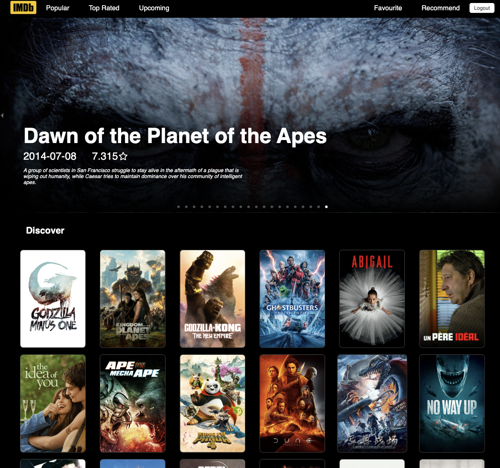
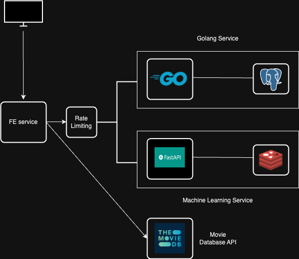

<h1 align="center">CineScope</h1>

<br>
<p align="center">🎬 An ultimate movie companion app gives you access to a vast collection of top-rated, trending, and popular movies from IMDb. With an advanced machine learning algorithms, the app personalize your movie recommendations based on your favorite movies</p><br/>
<br/>



# Feature

- Microservices
- Stateful Token Authentication
- Cookie-based session management
- Token-bucket IP-based rate limiter
- Managing SQL Query Timeouts
- Server Graceful Shutdown
- Query Caching with Redis
- SWR caching 
- Data Scraping
- Machine Learning

# Architecture



# 🛠 Getting Started

prerequisites: Docker and docker compose

```
git clone https://github.com/nhan10132020/Microservices-IMDB-Recommended-System.git
cd Microservices-IMDB-Recommended-System
```

## Installation

#### Docker

in the root directory, run:

```bash
make docker-compose-up
```

The app will be up and running at http://localhost:8080. 

if you want to config the app -> change environment variables in .env.build file

docker compose down with `make docker-compose-down`

## Development

Dowload all dependencies for application (python, golang, reactjs)

for client `npm i`, for server `go mod download`, for AI `pip install -r requirements.txt`

You can make the environment of app and setting up the database with:

```bash
make environment 

make database-setup
```

Modify the configuration of the .env file in AI, server, and client to accommodate any environment settings.

For databases config, modify their docker environment in .env.build file

Migrations data for database with:

```bash
make mygrateup
```

Running up server, AI and client:

```bash
make backend
```

```bash
make client
```

The app will be up and running at http://localhost:3000. 

## Web scraping newest movies data

`cd AI` 

- clear all data in genres.csv and movie.csv
- run `scraping_genres.ipynb` and `scraping_movie.ipynb`